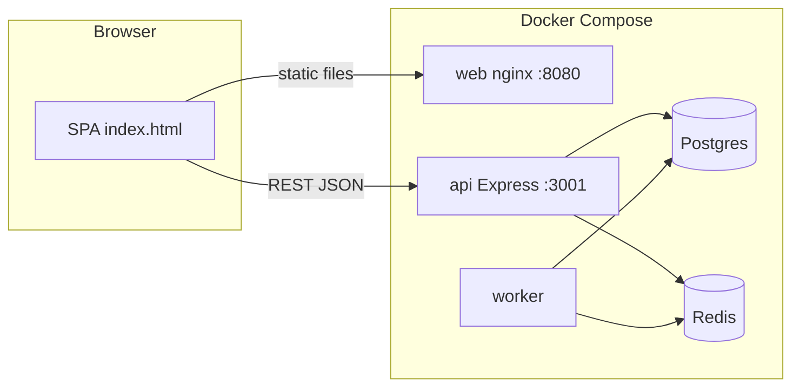
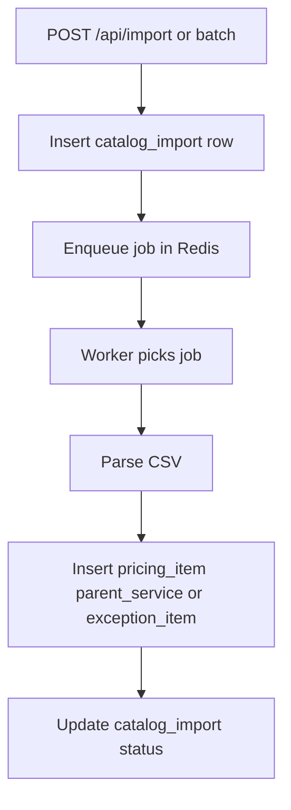
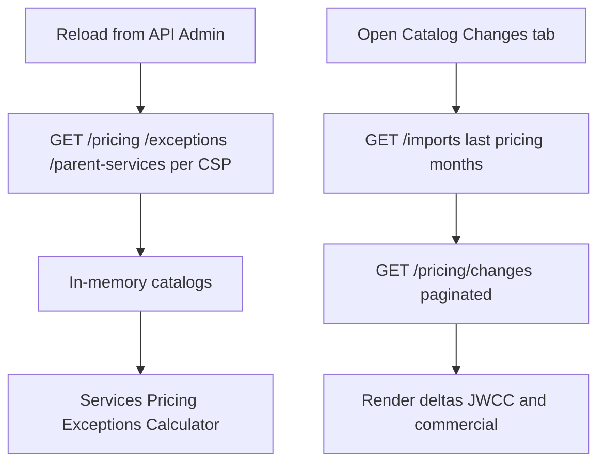

# CloudPrism (RosettaStone)

Proof-of-concept **FinOps / JWCC-style catalog browser**: compare **cloud service offerings**, **pricing** (JWCC + commercial list), and **exceptions** across **AWS, Azure, GCP, and Oracle**, with optional **PostgreSQL-backed** imports and **month-over-month catalog change** reporting.

## How it fits together

The app is a **static single-page UI** served by Nginx, talking to a **Node/Express API**. CSV uploads are processed by a **background worker** using **BullMQ** and **Redis**; canonical data lives in **PostgreSQL**.



### Import path (CSV to database)



### Typical UI data path



## Quick start

```powershell
docker compose up --build
```

| URL | Purpose |
|-----|---------|
| http://localhost:8080 | Web UI (static site) |
| http://localhost:3001 | API (`GET /health` to verify) |

Default DB user/database/password in Compose: `cloudprism`. Set a strong **`JWT_SECRET`** for anything beyond local use.

## Repository layout

| Path | Role |
|------|------|
| [`index.html`](index.html) | App shell, styles, main inline logic |
| [`src/app/`](src/app/) | Exceptions, catalog changes, reports modules |
| [`src/data/`](src/data/) | Taxonomy / diff / inference helpers |
| [`backend/`](backend/) | Express API, auth, worker entry |
| [`infra/`](infra/) | Nginx config, Postgres `init.sql` |
| [`docs/ARCHITECTURE.md`](docs/ARCHITECTURE.md) | **Extended flowcharts** and component notes |
| [`FULLSTACK.md`](FULLSTACK.md) | Endpoints, env vars, tables, deployment notes |

## Documentation

- **[docs/ARCHITECTURE.md](docs/ARCHITECTURE.md)** — Flowcharts (runtime, import, UI tabs, optional local snapshot).
- **[FULLSTACK.md](FULLSTACK.md)** — API reference, environment variables, security posture for imports.

## License / status

Internal / PoC use unless otherwise noted. Verify categories and prices against official CSP documentation.
