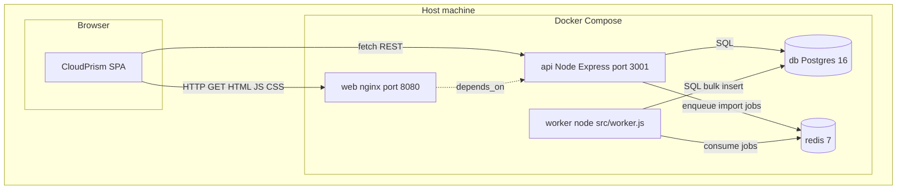
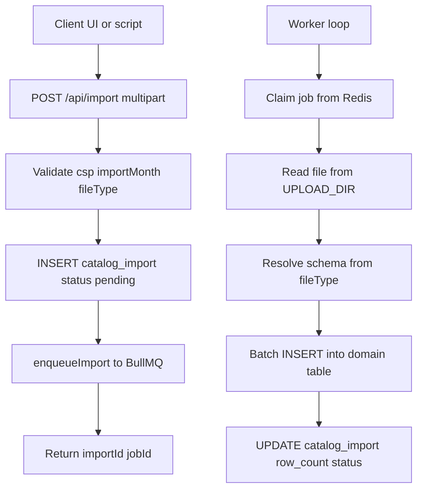
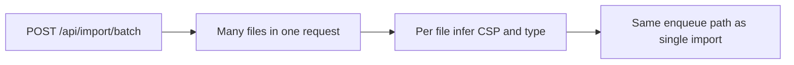
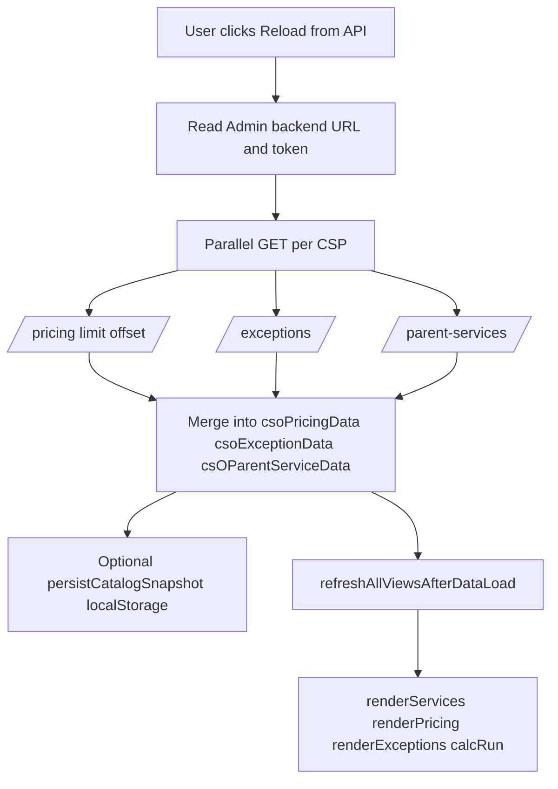
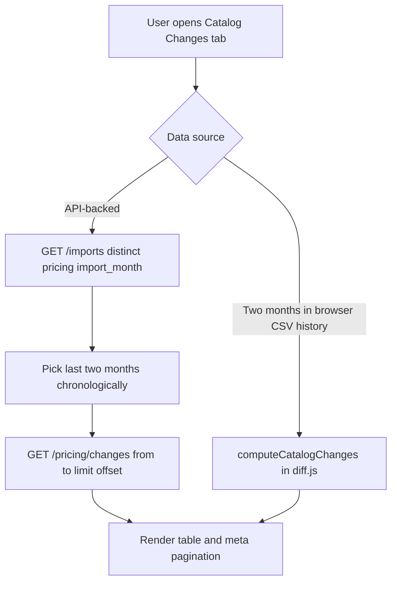
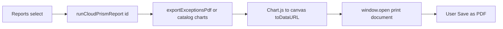
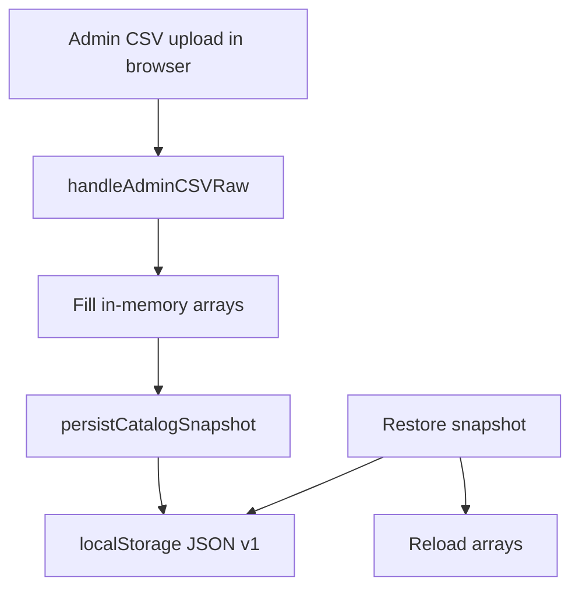
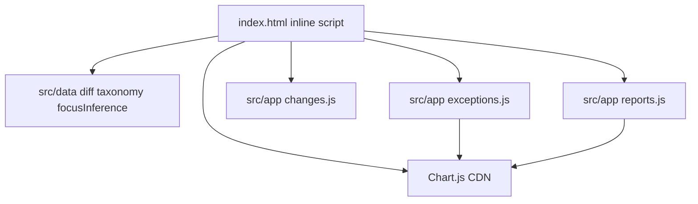

# Architecture and flowcharts

This document expands on [README.md](../README.md) with Mermaid diagrams you can render in GitHub, GitLab, VS Code (preview), or any Mermaid-capable viewer.

## 1. Runtime topology (Docker Compose)

Services and how they connect:

**Volumes:** Postgres data, Redis AOF, shared `uploads` volume for CSV files between API (multer) and worker.

---

## 2. CSV import (single file)

**Domain tables:** `pricing_item`, `parent_service`, or `exception_item`, each referencing `catalog_import.id` as `import_id`.

---

## 3. Batch import

Optional **manifest** JSON maps filename to `{ csp, fileType }`. Filename heuristics apply when manifest is partial.

---

## 4. Browser: load catalogs from API

**Note:** `catalogHistoryByMonth` is cleared on API reload so **Catalog Changes** does not use stale browser-only history.

---

## 5. Browser: Catalog Changes tab (lazy, large catalogs)

Server-side diff avoids loading two full months of pricing into memory for **very large** catalogs.

---

## 6. Browser: Reports dropdown (PDF via print)

Runs **on demand** only; no background polling.

---

## 7. Optional local snapshot (no API)

Snapshot stores **pricing, exceptions, parent** arrays only — not full multi-month history (quota). **Exception month-over-month** deltas in the UI are **API-backed** (`GET /exceptions/changes`); the snapshot alone does not retain per-month exception snapshots for diffing.

---

## 8. Frontend module map (high level)

---

## Related files

| Topic | Location |
|--------|-----------|
| HTTP routes | `backend/src/server.js` |
| Auth | `backend/src/auth.js` |
| Queue / worker | `backend/src/queue.js`, `backend/src/worker.js` |
| Schema | `infra/db/init.sql` |
| Nginx static + body size | `infra/nginx/default.conf` |
| Full API and env list | [FULLSTACK.md](../FULLSTACK.md) |
